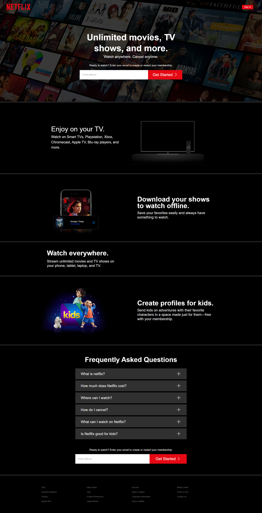

<h1>Netflix Clone</h1>

This is a clone of the Netflix website for learning purposes. It is only frontend and no backend is implemented.

## Technologies used

-   Next.js
-   TailwindCSS
-   Bootstrap icons

[Live Link](https://clone-netlify.netlify.app/)

